

<picture>
  <source media="(prefers-color-scheme: dark)" srcset="./assets/wave-dark.svg">
  <source media="(prefers-color-scheme: light)" srcset="./assets/wave-light.svg">
  
</picture>

<picture>
  <source media="(prefers-color-scheme: dark)" srcset="./hero-dark.svg">
  <source media="(prefers-color-scheme: light)" srcset="./hero-light.svg">
  
</picture>

<picture>
  <source media="(prefers-color-scheme: dark)" srcset="./arena-dark.svg">
  <source media="(prefers-color-scheme: light)" srcset="./arena-light.svg">
  
</picture>

<picture>
  <source media="(prefers-color-scheme: dark)" srcset="./assets/typing-dark.svg">
  <source media="(prefers-color-scheme: light)" srcset="./assets/typing-light.svg">
  
</picture>

<picture>
  <source media="(prefers-color-scheme: dark)" srcset="./assets/section-about-dark.svg">
  <source media="(prefers-color-scheme: light)" srcset="./assets/section-about-light.svg">
  
</picture>

> A developer profile built around a simple idea:
> **keep it clean, technical, and focused.**

I'm **Lughx**, real name **Thai Nhat Minh**.

My GitHub account is **[@xlughzdev](https://github.com/xlughzdev)**. I build software using **C#**, **Java**, **HTML5**, **CSS3**, **SQL**, **PostgreSQL**, **JavaScript**, **Node.js**, **C++**, **Rust**, and **Dockerfile**.

<picture>
  <source media="(prefers-color-scheme: dark)" srcset="./assets/section-stack-dark.svg">
  <source media="(prefers-color-scheme: light)" srcset="./assets/section-stack-light.svg">
  
</picture>

<picture>
  <source media="(prefers-color-scheme: dark)" srcset="./assets/ticker-dark.svg">
  <source media="(prefers-color-scheme: light)" srcset="./assets/ticker-light.svg">
  
</picture>

<picture>
  <source media="(prefers-color-scheme: dark)" srcset="./assets/section-identity-dark.svg">
  <source media="(prefers-color-scheme: light)" srcset="./assets/section-identity-light.svg">
  
</picture>

<picture>
  <source media="(prefers-color-scheme: dark)" srcset="./assets/idcard-dark.svg">
  <source media="(prefers-color-scheme: light)" srcset="./assets/idcard-light.svg">
  
</picture>

<picture>
  <source media="(prefers-color-scheme: dark)" srcset="./assets/section-connect-dark.svg">
  <source media="(prefers-color-scheme: light)" srcset="./assets/section-connect-light.svg">
  
</picture>

  <a href="https://github.com/xlughzdev">
<picture>
  <source media="(prefers-color-scheme: dark)" srcset="./assets/btn-github-dark.svg">
  <source media="(prefers-color-scheme: light)" srcset="./assets/btn-github-light.svg">
  
</picture>
  </a>
  <a href="https://www.facebook.com/iamlughx">
<picture>
  <source media="(prefers-color-scheme: dark)" srcset="./assets/btn-facebook-dark.svg">
  <source media="(prefers-color-scheme: light)" srcset="./assets/btn-facebook-light.svg">
  
</picture>
  </a>
  <a href="https://www.tiktok.com/@lughx.08">
<picture>
  <source media="(prefers-color-scheme: dark)" srcset="./assets/btn-tiktok-dark.svg">
  <source media="(prefers-color-scheme: light)" srcset="./assets/btn-tiktok-light.svg">
  
</picture>
  </a>

  <a href="https://discord.gg/lughxshop">
<picture>
  <source media="(prefers-color-scheme: dark)" srcset="./assets/btn-discord-server-dark.svg">
  <source media="(prefers-color-scheme: light)" srcset="./assets/btn-discord-server-light.svg">
  
</picture>
  </a>
  <picture>
  <source media="(prefers-color-scheme: dark)" srcset="./assets/btn-discord-dark.svg">
  <source media="(prefers-color-scheme: light)" srcset="./assets/btn-discord-light.svg">
  
</picture>

<picture>
  <source media="(prefers-color-scheme: dark)" srcset="./assets/bootlog-dark.svg">
  <source media="(prefers-color-scheme: light)" srcset="./assets/bootlog-light.svg">
  
</picture>

<picture>
  <source media="(prefers-color-scheme: dark)" srcset="./assets/footer-dark.svg">
  <source media="(prefers-color-scheme: light)" srcset="./assets/footer-light.svg">
  
</picture>

